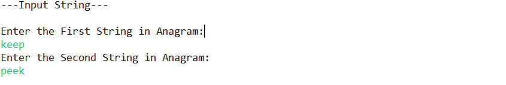
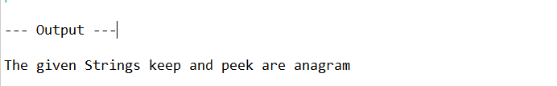
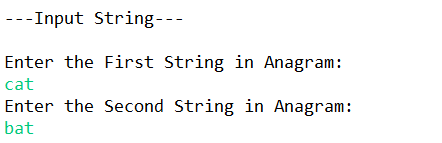
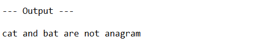
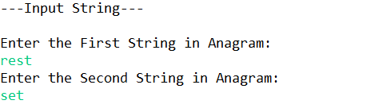
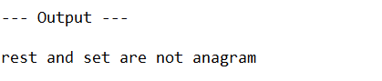

# ANAGRAM PROGRAM

## Table of content ##

- Description
- Cases
- Input String
- Output

---

### Description: 
An anagram is a word or phrase formed by rearranging the letters in another word or phrase.

- Anagram program link 
  [program](https://github.com/Frooti31/Programs/blob/javaProgram/anagram/Anagram.java)

---
## Cases:  ##
**In this case the given both strings are anagram.** 
###### Input :
 
   
    
###### Output:
   
   
   ---

   
---  

   **In this case the given both string are not anagram.**
#### Input:

###### Output:
     

---

**In this case the given both strings length is not equal.so both string are not anagram.**
###### Input: 

###### Output:
